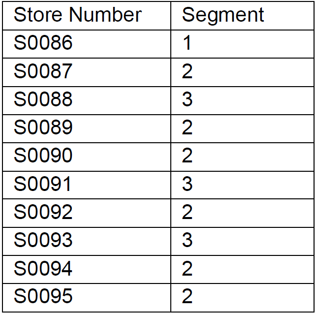
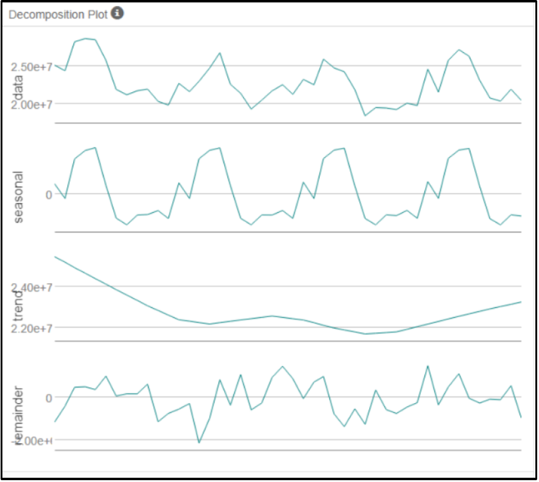

# Alteryx : Predictive Analytics for Business

### Task 1: Determine Store Formats for Existing Stores

#### 1. What is the optimal number of store formats? How did you arrive at that number?

The optimal number of store formats are 3. • I arrived that number by filtering the sales data only for 2015 and then I grouped the sum sales of each category by store and get the total sales per store and calculated the percentage of each food category. Finally, I configured K-Centroids Cluster Analysis tool with 9 fields and used z-score to standardize the fields and used K-means clustering method.

#### 2. How many stores fall into each store format?

25 stores fall in cluster 1, 35 in cluster 2, and 25 stores in cluster 3.

Please NOTE that the above mentioned numbers are via latest version of Alteryx as discussed in the thread and verified by a Mentor here. I don’t have enough memory and storage space to accommodate both versions at the same time.

#### 3. Based on the results of the clustering model, what is one way that the clusters differ from one another?

Box-whisker plots in the Rand indices show how tight the indices for each data point are within each other.

Some of the observed differences between the selected clusters are:
a. Cluster 2 is leading with higher sales than the other two.

b. Cluster 2 shows the also appears to be leading the sales in each individual category as well.

c. Moreover, majority of the stores fall into cluster two as it can be seen in the visualization given below:

#### 4. Please provide a Tableau visualization (saved as a Tableau Public file) that shows the location of the stores, uses color to show cluster, and size to show total sales.

The below map is showing all three clusters with sum of total sales based on City and State.

### Task 2: Formats for New Stores

#### 1. What methodology did you use to predict the best store format for the new stores? Why did you choose that methodology? (Remember to Use a 20% validation sample with Random Seed = 3 to test differences in models.)

a. We joined the demographic data with the data we got from cluster analysis and then we split the data into estimation and validation data as 80% and 20% respectively and set the Random Seed to 3. Then we build our three models as; Decision Tree, Random Forest Model, and Boosted Model and make a comparison between them.

b. We selected the Boosted Model out of all three because of the overall high accuracy among others and scored with the data of 10 new stores for segmentation.

#### 2. What format do each of the 10 new stores fall into?

### Task 3: Predicting Produce Sales
#### 1. What type of ETS or ARIMA model did you use for each forecast? Use ETS(a,m,n) or ARIMA(ar, i, ma) notation. How did you come to that decision?

a. We chose ETS(m,n,m) model based on the output of TS tool that provides the Decomposition plots (as shown below). The peak waves for seasonality decrease gradually and that’s multiplicative, then comes the trend, which is not consistent, and then the remainder has non-consistent movements and deviation between high and low values which should be multiplicative as well.

b. Auto option should do the trick for best model selection. Justifying the terms for ARIMA model is out of the score for this project, since we are using ETS model and the notations are already justified based on the decomposition plot in the above-mentioned point.

c. After setting up the both model’s environment, we compare them via TS Compare tool and also got the result in favor of ETS model (as shown in the result plot below), ETS model’s forecast is more accurate than ARIMA model as compared to the Actual data.

d. The justification given in the previous point is showing the forecast error measurements against the 6 months holdout samples, but the graph given below is more appropriate after zooming in the above shown graph showing only the comparison between all three.

#### 2. Please provide a table of your forecasts for existing and new stores. Also, provide visualization of your forecasts that includes historical data, existing stores forecasts, and new stores forecasts.

a. Table for existing and new stores forecast sales is given below:

b. Tableau visualization for our stores historical data vs. forecast data for new and existing stores is shown below:

